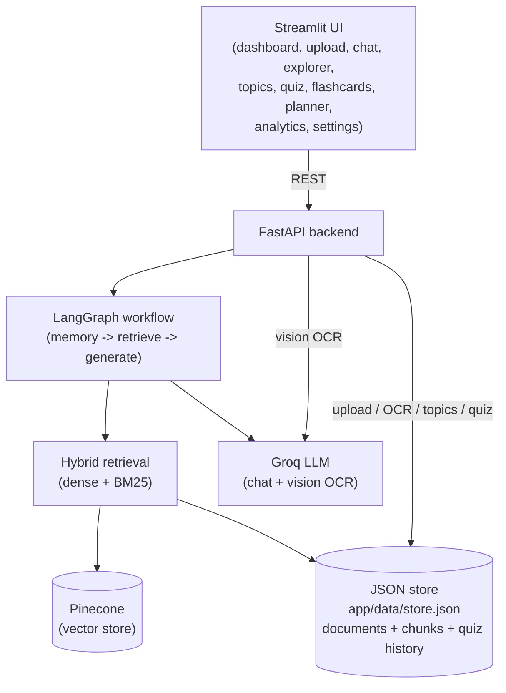
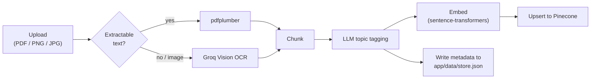

# AI Study Companion

A retrieval-augmented learning assistant. Upload PDFs or images (including
scanned and handwritten notes), and it extracts, chunks, embeds, and indexes
the content to support question answering, topic-scoped summaries, quizzes,
flashcards, and a personalized study planner.

This started as a document Q&A ("chat with your PDFs") project and was
extended into a full study-companion product to demonstrate a broader set of
AI engineering skills: hybrid retrieval, multimodal OCR, topic-aware
indexing, LLM-graded quiz generation, and evaluation.

## Features

- PDF and image upload, with automatic OCR fallback for scanned pages and
  handwritten notes (Groq Vision)
- Optional preview/correct step before indexing OCR'd text
- Hybrid retrieval: dense (Pinecone) + BM25, selectable per query
- Multi-document support with per-document or per-topic scoping
- LLM-based topic detection and tagging at ingest time
- Conversational chat with citation-backed answers (source + page + score)
- "Tutor mode": free-form instructional prompts scoped to a topic
  (e.g. "explain like I'm a beginner", "give me a real-world example")
- Quiz generation (MCQ / true-false / fill-in-the-blank / mixed, configurable
  difficulty and length) with instant grading, explanations, and references
- Flashcard generation
- Study planner that prioritizes weak topics from quiz history
- Analytics dashboard (documents, chunks, topics, quizzes, average score,
  weakest topics)
- RAG evaluation harness (faithfulness, answer relevancy, contextual
  precision/recall) judged by Groq, no OpenAI key required

## Architecture



Ingestion pipeline:



## Tech Stack

| Layer | Choice |
|---|---|
| Backend | FastAPI |
| Frontend | Streamlit |
| Workflow orchestration | LangGraph |
| LLM | Groq (`llama-3.3-70b-versatile` by default) |
| Vision OCR | Groq Vision (`meta-llama/llama-4-scout-17b-16e-instruct` by default) |
| Vector database | Pinecone |
| Embeddings | Sentence Transformers (configurable via `EMBEDDING_MODEL`) |
| Retrieval | Hybrid — dense (Pinecone) + BM25 (`rank-bm25`) |
| Evaluation | DeepEval, judged by Groq |
| Deployment | Podman (Dockerfile + compose) |

The exact LLM/embedding model names in use are read live from `/system/info`
and shown on the Dashboard/Analytics/About pages, so they can't drift out of
sync with your `.env`.

## Project Structure

```
app/                     FastAPI backend
  api/routes/            upload, chat, documents, topics, quiz, study,
                         analytics, system
  core/                  settings, constants, logging
  graph/                 LangGraph state/nodes/graph
  memory/                conversation memory
  schemas/               Pydantic request/response models
  services/              PDF/vision OCR, chunking, embeddings, Pinecone,
                         BM25 + hybrid retrieval, topics, quiz, flashcards,
                         study planner, citations, JSON store
  uploads/               saved PDF/image uploads (served at /files)
  data/                  store.json — document/chunk/quiz metadata (no DB)
streamlit_app/           Streamlit frontend (multipage via st.navigation)
  views/                 one file per page
  api_client.py           thin REST client for the backend
eval/                    DeepEval-based RAG evaluation harness
Dockerfile.backend
Dockerfile.frontend
docker-compose.yml
```

## Design Notes

- **No database.** There is no SQL/NoSQL database. Embeddings live in
  Pinecone; document/chunk/quiz metadata lives in a local JSON file
  (`app/data/store.json`, gitignored) so BM25/hybrid retrieval, the
  Document Explorer, topic browsing, and quiz history all work without a
  DB server.
- **No authentication.** This is a single-user portfolio project.
  Conversation memory and the JSON store are process-global, not
  per-session.
- **Hybrid retrieval caveat.** BM25/hybrid retrieval only covers documents
  uploaded after the JSON store existed. If you already had vectors in
  Pinecone from an older version of this project, they won't show up in
  BM25/hybrid results until re-uploaded (dense-only search still works
  against them).

## Setup

### 1. Local environment

```bash
python -m venv .venv
.venv\Scripts\activate        # Windows
pip install -r requirements.txt
```

Create `.env` in the project root:

```ini
APP_NAME=AI Study Companion
APP_VERSION=0.1.0
API_PREFIX=/api

GROQ_API_KEY=your-groq-key
PINECONE_API_KEY=your-pinecone-key
PINECONE_INDEX=your-index-name

EMBEDDING_MODEL=sentence-transformers/all-MiniLM-L6-v2

# Optional overrides (defaults shown)
CHUNK_SIZE=500
CHUNK_OVERLAP=100
DEFAULT_TOP_K=5
SIMILARITY_THRESHOLD=0.10
HYBRID_ALPHA=0.5
BM25_CANDIDATE_POOL=30
GROQ_MODEL=llama-3.3-70b-versatile
GROQ_VISION_MODEL=meta-llama/llama-4-scout-17b-16e-instruct
DEFAULT_TEMPERATURE=0.2
DEFAULT_MAX_TOKENS=1024
OCR_MIN_CHARS_PER_PAGE=20
LOG_LEVEL=INFO
```

Your Pinecone index's vector dimension must match `EMBEDDING_MODEL`'s output
(384 for `all-MiniLM-L6-v2`).

### 2. Run the backend

```bash
uvicorn app.main:app --reload --port 8000
```

### 3. Run the frontend

```bash
streamlit run streamlit_app/app.py
```

By default the frontend talks to `http://localhost:8000`; override with the
`BACKEND_URL` environment variable if the backend runs elsewhere.

### 4. Run the evaluation harness

```bash
python -m eval.evaluate_rag
```

Indexes a small self-contained fixture, scores it with DeepEval metrics
judged by Groq, and cleans up afterwards — no OpenAI key or pre-existing
data required.

## Running with Podman

```bash
podman compose build
podman compose up -d
```

- Backend: http://localhost:8000
- Frontend: http://localhost:8501

The backend container reads secrets from your local `.env` via `env_file:`
(never baked into the image) and mounts `app/uploads/` and `app/data/` as
volumes so uploads and the JSON store persist across restarts. Stop with:

```bash
podman compose down
```

Both services share one `requirements.txt` for simplicity; splitting it per
service would shrink the frontend image (it doesn't need `torch` or
`sentence-transformers`) at the cost of keeping two files in sync.

## API Overview

| Route | Purpose |
|---|---|
| `POST /upload/` | One-step upload, extract, chunk, tag, embed, index |
| `POST /upload/preview` | Extract only (with OCR), for review before indexing |
| `POST /upload/confirm` | Index previously-previewed (possibly corrected) text |
| `GET/DELETE /documents/` | List/inspect/delete indexed documents |
| `POST /chat/` | Ask a question (mode, top_k, document/topic scope, generation params) |
| `POST /chat/clear` | Clear conversation memory |
| `GET /topics/` | List topics across documents |
| `GET /topics/{topic}/summary` | LLM summary of a topic |
| `POST /quiz/generate` | Generate a quiz for a topic |
| `POST /quiz/evaluate` | Grade submitted answers, record the attempt |
| `POST /flashcards/generate` | Generate flashcards for a topic |
| `POST /study/plan` | Generate a day-by-day study plan |
| `GET /analytics/` | Aggregate stats + weakest topics |
| `GET /system/info` | Live model/vector-db configuration |
